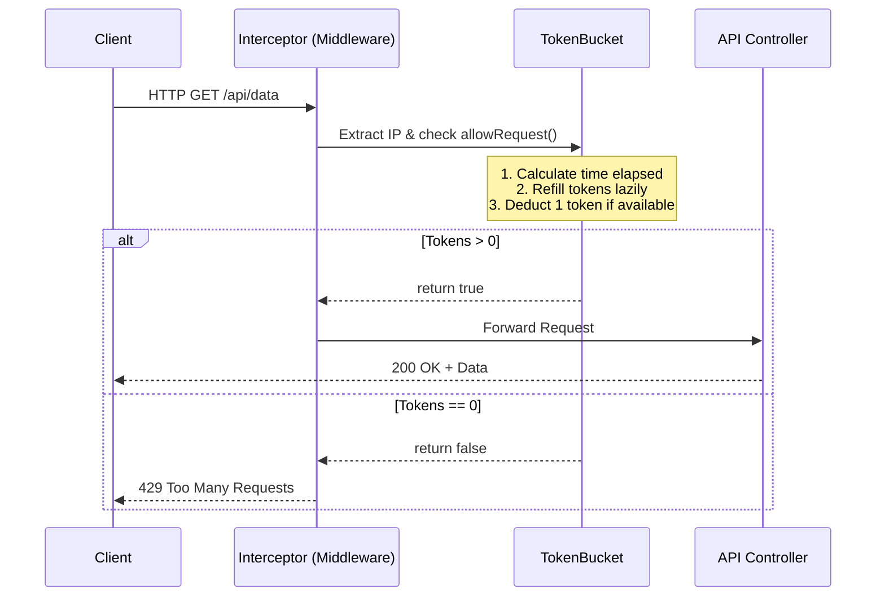

# 🛡️ Low-Latency Token Bucket Rate Limiter

[](https://www.java.com/)
[](https://spring.io/projects/spring-boot)
[](https://www.docker.com/)
[](https://low-latency-token-bucket-rate-limiter.onrender.com)

A production-ready, low-latency API Rate Limiter built from scratch using **Java** and **Spring Boot**. This project acts as a security middleware layer to protect backend servers from DDoS attacks, brute-force attempts, and spam by implementing a thread-safe **Token Bucket Algorithm**.

### 🚀 Live Demo
**Test the rate limiter live here:** [https://low-latency-token-bucket-rate-limiter.onrender.com](https://low-latency-token-bucket-rate-limiter.onrender.com)
*(Click the "Send API Request" button rapidly to watch the algorithm block your IP in real-time).*

---

## 🧠 System Architecture & Logic

This application intercepts all incoming API requests and evaluates them against an in-memory token bucket assigned to the user's IP address. 

### The Token Bucket Algorithm
1. **Capacity:** Each user (IP) gets a bucket holding a maximum of `5 tokens`.
2. **Cost:** Every API request costs exactly `1 token`.
3. **Rejection:** If the bucket reaches `0 tokens`, the request is blocked, returning an **HTTP 429 Too Many Requests** status.
4. **Refill:** Tokens are dynamically replenished at a rate of `5 tokens per minute`.

### ⚡ Lazy Evaluation (The Performance Secret)
Rather than running thousands of expensive background threads to refill user buckets every few seconds (which would crash the server CPU under heavy load), this system uses **Lazy Evaluation**. 
* Tokens are *only* calculated and refilled at the exact millisecond a user makes a new request. 
* It uses high-precision millisecond math (`System.currentTimeMillis()`) to calculate the exact time elapsed since the last request, retroactively depositing the correct fractional amount of tokens.



---

## 🛠️ Key Technical Implementations

* **High Concurrency & Thread Safety:** Utilizes `ConcurrentHashMap` to safely map IP addresses to buckets across multiple simultaneous network requests. All token mutation logic is wrapped in `synchronized` blocks to prevent race conditions (double-spending tokens).
* **Precision Math:** Avoids floating-point math inaccuracies by converting all time constraints to pure milliseconds. Prevents "time leakage" by preserving leftover fractional milliseconds for the next calculation loop.
* **Dynamic Configuration:** Limits and refill rates are fully decoupled from the Java code and injected dynamically via Spring's `@Value` from `application.properties`.
* **Custom HTTP Headers:** Injects `X-Rate-Limit-Remaining` into every response to give clients real-time visibility into their quota.

---

## 📐 System Design Considerations: Scaling to Distributed

* **Current State:** This is an **in-memory** rate limiter. State is held in the RAM of the running Java application instance.
* **Future Scaling:** If deployed behind a Load Balancer to multiple servers (horizontal scaling), the in-memory cache would fragment (e.g., a user could hit Server A 5 times, and Server B 5 times). To scale this to a distributed microservices environment, the `ConcurrentHashMap` would be replaced with **Redis**, utilizing Redis `EVAL` Lua scripts to guarantee atomic token decrements across multiple server instances.

---

## 💻 Local Setup & Installation

### Prerequisites
* Java 17+
* Maven
* Docker (Optional)

### Run Locally (Standard)
1. Clone the repository:
   ```bash
   git clone [https://github.com/shreyansh2708-git/Low-Latency-Token-Bucket-Rate-Limiter.git](https://github.com/shreyansh2708-git/Low-Latency-Token-Bucket-Rate-Limiter.git)
   cd Low-Latency-Token-Bucket-Rate-Limiter
   ```
2. Build and run the application using the Maven wrapper:
   ```bash
   ./mvnw spring-boot:run
   ```
3. Open your browser and navigate to: `http://localhost:8080`

### Run using Docker
1. Build the Docker image:
   ```bash
   docker build -t rate-limiter-app .
   ```
2. Run the container:
   ```bash
   docker run -p 8080:8080 rate-limiter-app
   ```

---

## 📡 API Reference

### 1. Successful Request
**Request:** `GET /api/data`

**Response:** `200 OK`
```json
{
  "status": "Success",
  "message": "You safely accessed protected server data!"
}
```
*Headers:* `X-Rate-Limit-Remaining: 4`

### 2. Rate Limited Request
**Request:** `GET /api/data`

**Response:** `429 Too Many Requests`
```json
{
  "error": "Too Many Requests",
  "message": "You have exceeded your limit of 5 requests per minute."
}
```
*Headers:* `X-Rate-Limit-Remaining: 0`

---
*Built to demonstrate foundational backend engineering, concurrency management, and system security.*
